# Utils Dependency Map

Updated: 2026-05-15.

Scope: internal dependencies between headers under `utils/` only. Standard
library, ROOT, toml++, POSIX, and `modules/` are omitted.

Umbrella wrapper headers (`Physics.hh`, `Config.hh`, etc.) are excluded as
nodes. Where a file includes a wrapper, the entry below names the subheader
that owns the used symbol.

Transitive edges are suppressed: if A → B and B → C, the A → C edge is
omitted.

---

## Dependency Tables

### `utils/Physics`

| File | Direct dependencies |
|---|---|
| `Physics/Types` | — |
| `Physics/TypeAid` | Physics/Types |
| `Physics/Kinematics` | Physics/Types |
| `Physics/Properties` | Physics/Types |

### `utils/Utility`

| File | Direct dependencies |
|---|---|
| `Utility/RootTypes` | — |
| `Utility/Number` | — |
| `Utility/Time` | Config/Types |

### `utils/Config`

| File | Direct dependencies |
|---|---|
| `Config/LimitAid` | — |
| `Config/Types` | Probe/Types |
| `Config/TypeAid` | Config/Types |
| `Config/Defaults` | Config/TypeAid, Config/LimitAid, Physics/TypeAid |
| `Config/Reader` | Config/Defaults, Utility/Number, Probe/ConfigAid |
| `Config/Configure` | Config/Reader, Probe/Configuration, Monitor/Configure |

`Config/Types` also pulls `Physics/Types` directly, but that edge is implied
by `Config/Types → Probe/Types → Physics/Types`.

### `utils/Probe`

| File | Direct dependencies |
|---|---|
| `Probe/Types` | Physics/Types, Utility/RootTypes |
| `Probe/BranchControl` | Probe/Types |
| `Probe/ConfigAid` | Probe/BranchControl |
| `Probe/Readers` | Probe/BranchControl |
| `Probe/Parallel` | Probe/BranchControl |
| `Probe/ParallelIMT` | Probe/Types |
| `Probe/Administration` | Probe/Parallel, Probe/ParallelIMT |
| `Probe/Methods` | Probe/ParallelIMT, Probe/Readers |
| `Probe/Directives` | Probe/Administration, Probe/Methods |
| `Probe/Configuration` | Config/Reader, Probe/Administration, Probe/ConfigAid |

`Probe/ConfigAid` is a dep of both `Probe/Configuration` and `Config/Reader`;
the path `Probe/ConfigAid → Probe/BranchControl → Probe/Parallel →
Probe/Administration → Probe/Configuration` means the direct
`Probe/ConfigAid → Probe/Configuration` edge is not redundant.

### `utils/Record`

| File | Direct dependencies |
|---|---|
| `Record/Types` | Config/Types, Utility/RootTypes |
| `Record/Type_Methods` | Record/Types *(mutual)* |
| `Record/Requests` | Record/Types |
| `Record/Configs` | Config/Types |
| `Record/Meta` | Config/Types |
| `Record/Writer` | Record/Configs, Record/Meta, Record/Requests, Record/Types |
| `Record/Declaration` | Record/Writer, Physics/Properties *(impl fragment)* |
| `Record/Recording` | Record/Writer, Physics/Properties, Record/Type_Methods, Record/Meta *(impl fragment)* |
| `Record/Directives` | Record/Writer *(impl fragment)* |
| `Record/Cloning` | Record/Writer *(impl fragment)* |
| `Record/Administration` | Record/Writer, Monitor/Administration, Monitor/Directive *(impl fragment + cross-module)* |

`Record/Writer` physically includes its impl fragments; each fragment
re-includes `Record/Writer` — mutual cycles, kept as-is in the diagram.
`Record/Types ↔ Record/Type_Methods` is a similar split-definition cycle.

### `utils/Monitor`

| File | Direct dependencies |
|---|---|
| `Monitor/Types` | Config/Types |
| `Monitor/Logger` | Record/Requests, Monitor/Types |
| `Monitor/Methods` | Utility/Number, Utility/Time, Monitor/Types |
| `Monitor/Render` | Monitor/Logger, Monitor/Methods |
| `Monitor/Report` | Record/Writer, Monitor/Render |
| `Monitor/Directive` | Monitor/Report |
| `Monitor/Administration` | Record/Writer, Monitor/Render |
| `Monitor/Configure` | Monitor/Administration, Monitor/Directive |
| `Monitor/ConfigAid` | Monitor/Configure |
| `Monitor/Timer` | — |
| `Monitor/Snapshot` | — *(empty)* |

Reduced edges: `Monitor/Logger → Monitor/Administration` and
`Monitor/Methods → Monitor/Administration` are implied by
`Monitor/Logger → Monitor/Render → Monitor/Administration` and
`Monitor/Methods → Monitor/Render → Monitor/Administration`.
Similarly, `Monitor/Logger/Methods/Render → Monitor/Directive` are all implied
by `Monitor/Report → Monitor/Directive`.

### `utils/Paint`

| File | Direct dependencies |
|---|---|
| `Paint/Types` | — |
| `Paint/Style` | Paint/Types |
| `Paint/Apply` | Paint/Style |
| `Paint/Save` | Paint/Apply |
| `Paint/Book` | Paint/Style |
| `Paint/Render` | — |
| `Paint/Resolve` | — |
| `Paint/Illustrator` | Paint/Book, Paint/Render, Paint/Resolve |

---

## Package-Level Shape

- **Physics** is the base domain layer; no internal `utils/` dependencies.
- **Utility/Number** and **Utility/RootTypes** are fully independent leaves.
  Only `Utility/Time` reaches into `Config/Types` for clock aliases.
- **Config/Types** is the hub that bridges `Probe/Types` and the runtime
  limit/config types; almost everything depends on it transitively.
- **Probe** depends on Physics and Utility/RootTypes at the bottom, and on
  `Config/Reader` only in `Probe/Configuration` for thread-count resolution.
- **Record** depends on Config and Physics; its writer is coupled to Monitor
  through `Record/Administration` (fatal-stall / bind-writer pattern).
- **Monitor** depends on Config, Utility, and `Record/Writer`; `Monitor/Logger`
  is declaration-only (no method bodies) to keep its include surface small.
- **Paint** is isolated from the Probe/Record/Monitor runtime stack.

---

## Notable Cycles

| Cycle | Reason |
|---|---|
| `Record/Types ↔ Record/Type_Methods` | Type declarations and inline method bodies are in separate files |
| `Record/Writer ↔ {Declaration, Recording, Directives, Cloning, Administration}` | Class declared in Writer; method bodies in impl fragments that re-include Writer |
| `Monitor/Administration → Record/Writer → Record/Administration → Monitor/Administration` | Writer binds the logger (watch-dog pattern); logger drives writer checkpoints |
| `Config/Types → Probe/Types` (and back via Config/Reader → Probe/ConfigAid) | Config owns `CollectionSpec` but needs it from Probe; Reader uses Probe's TOML parser |

---

## Flowchart

Paste into [Mermaid Live](https://mermaid.live).

Edge direction: **dependency → consumer** (foundations appear at top in TD layout).

```mermaid
flowchart TD
    subgraph PhysicsModule[Physics]
        PTypes[Physics/Types]
        PTypeAid[Physics/TypeAid]
        PKinematics[Physics/Kinematics]
        PProperties[Physics/Properties]
    end

    subgraph UtilityModule[Utility]
        UNumber[Utility/Number]
        URootTypes[Utility/RootTypes]
        UTime[Utility/Time]
    end

    subgraph ConfigModule[Config]
        CLimitAid[Config/LimitAid]
        CTypes[Config/Types]
        CTypeAid[Config/TypeAid]
        CDefaults[Config/Defaults]
        CReader[Config/Reader]
        CConfigure[Config/Configure]
    end

    subgraph ProbeModule[Probe]
        PrTypes[Probe/Types]
        PrBranchControl[Probe/BranchControl]
        PrConfigAid[Probe/ConfigAid]
        PrReaders[Probe/Readers]
        PrParallel[Probe/Parallel]
        PrParallelIMT[Probe/ParallelIMT]
        PrAdministration[Probe/Administration]
        PrConfiguration[Probe/Configuration]
        PrMethods[Probe/Methods]
        PrDirectives[Probe/Directives]
    end

    subgraph RecordModule[Record]
        RTypes[Record/Types]
        RTypeMethods[Record/Type_Methods]
        RRequests[Record/Requests]
        RConfigs[Record/Configs]
        RMeta[Record/Meta]
        RWriter[Record/Writer]
        RDeclaration[Record/Declaration]
        RRecording[Record/Recording]
        RDirectives[Record/Directives]
        RCloning[Record/Cloning]
        RAdministration[Record/Administration]
    end

    subgraph MonitorModule[Monitor]
        MTypes[Monitor/Types]
        MLogger[Monitor/Logger]
        MMethods[Monitor/Methods]
        MRender[Monitor/Render]
        MReport[Monitor/Report]
        MAdministration[Monitor/Administration]
        MDirective[Monitor/Directive]
        MConfigure[Monitor/Configure]
        MTimer[Monitor/Timer]
    end

    subgraph PaintModule[Paint]
        PaTypes[Paint/Types]
        PaStyle[Paint/Style]
        PaApply[Paint/Apply]
        PaSave[Paint/Save]
        PaBook[Paint/Book]
        PaRender[Paint/Render]
        PaResolve[Paint/Resolve]
        PaIllustrator[Paint/Illustrator]
    end

    %% Physics
    PTypes --> PTypeAid
    PTypes --> PKinematics
    PTypes --> PProperties
    PTypes --> PrTypes

    %% Utility
    URootTypes --> PrTypes
    URootTypes --> RTypes
    CTypes --> UTime

    %% Config
    PrTypes --> CTypes
    CTypes --> CTypeAid
    CTypeAid --> CDefaults
    CLimitAid --> CDefaults
    PTypeAid --> CDefaults
    CTypes --> CReader
    UNumber --> CReader
    PrConfigAid --> CReader
    CReader --> CConfigure
    PrConfiguration --> CConfigure
    MConfigure --> CConfigure

    %% Probe
    PrBranchControl --> PrConfigAid
    PrBranchControl --> PrReaders
    PrBranchControl --> PrParallel
    PrTypes --> PrParallelIMT
    PrParallel --> PrAdministration
    PrParallelIMT --> PrAdministration
    CReader --> PrConfiguration
    PrAdministration --> PrConfiguration
    PrReaders --> PrMethods
    PrParallelIMT --> PrMethods
    PrAdministration --> PrDirectives
    PrMethods --> PrDirectives

    %% Record (mutual cycles shown with both directions)
    RTypes --> RTypeMethods
    RTypeMethods --> RTypes
    CTypes --> RConfigs
    CTypes --> RMeta
    RConfigs --> RWriter
    RMeta --> RWriter
    RRequests --> RWriter
    RTypes --> RWriter
    RWriter --> RDeclaration
    RDeclaration --> RWriter
    RWriter --> RRecording
    RRecording --> RWriter
    RWriter --> RDirectives
    RDirectives --> RWriter
    RWriter --> RCloning
    RCloning --> RWriter
    RWriter --> RAdministration
    RAdministration --> RWriter
    PProperties --> RDeclaration
    PProperties --> RRecording
    RTypeMethods --> RRecording
    RMeta --> RRecording

    %% Monitor (reduced: Logger/Methods → Administration implied via Render)
    RRequests --> MLogger
    MTypes --> MLogger
    UNumber --> MMethods
    UTime --> MMethods
    MTypes --> MMethods
    MLogger --> MRender
    MMethods --> MRender
    RWriter --> MReport
    MRender --> MReport
    RWriter --> MAdministration
    MRender --> MAdministration
    MReport --> MDirective
    MAdministration --> MConfigure
    MDirective --> MConfigure
    MAdministration --> RAdministration
    MDirective --> RAdministration

    %% Paint
    PaTypes --> PaStyle
    PaStyle --> PaApply
    PaApply --> PaSave
    PaStyle --> PaBook
    PaBook --> PaIllustrator
    PaRender --> PaIllustrator
    PaResolve --> PaIllustrator

    classDef physics fill:#d8ecff,stroke:#2878b5,color:#102a43
    classDef utility fill:#e8f7df,stroke:#4c8f2f,color:#1f3b16
    classDef config fill:#fff2c7,stroke:#b88700,color:#3f3000
    classDef probe fill:#eadcff,stroke:#7b4fc6,color:#2d174f
    classDef record fill:#ffdede,stroke:#bf4747,color:#4f1616
    classDef monitor fill:#dff7f4,stroke:#2b8c83,color:#123f3b
    classDef paint fill:#f6e1ff,stroke:#a34dbf,color:#42194f

    class PTypes,PTypeAid,PKinematics,PProperties physics
    class UNumber,URootTypes,UTime utility
    class CLimitAid,CTypes,CTypeAid,CDefaults,CReader,CConfigure config
    class PrTypes,PrBranchControl,PrConfigAid,PrReaders,PrParallel,PrParallelIMT,PrAdministration,PrConfiguration,PrMethods,PrDirectives probe
    class RTypes,RTypeMethods,RRequests,RConfigs,RMeta,RWriter,RDeclaration,RRecording,RDirectives,RCloning,RAdministration record
    class MTypes,MLogger,MMethods,MRender,MReport,MAdministration,MDirective,MConfigure,MTimer monitor
    class PaTypes,PaStyle,PaApply,PaSave,PaBook,PaRender,PaResolve,PaIllustrator paint
```

