# Utils Dependency Map

Updated: 2026-05-15.

Scope: internal dependencies between headers under `utils/` only. Standard
library, ROOT, toml++, POSIX, and project modules outside `utils/` are omitted.

This is a narrowed map: when a file includes an umbrella such as `Physics.hh`,
`Utility.hh`, `Record.hh`, `Probe.hh`, `Monitor.hh`, or `Config.hh`, the entry
below names the subheader that owns the used symbol. `Config.hh` remains listed
where its own facade functions are used.

## ASCII Tree

```text
utils/
|-- Physics.hh
|   |-- Physics/Types.hh
|   |-- Physics/TypeAid.hh
|   |   `-- Physics/Types.hh
|   |-- Physics/Kinematics.hh
|   |   `-- Physics/Types.hh
|   `-- Physics/Properties.hh
|       `-- Physics/Types.hh
|
|-- Utility.hh
|   |-- Utility/Number.hh
|   |-- Utility/RootTypes.hh
|   `-- Utility/Time.hh
|       `-- Config/Types.hh
|
|-- Config.hh
|   |-- Config/Types.hh
|   |   |-- Physics/Types.hh
|   |   `-- Probe/Types.hh
|   |       |-- Physics/Types.hh
|   |       `-- Utility/RootTypes.hh
|   |-- Config/TypeAid.hh
|   |   `-- Config/Types.hh
|   |-- Config/LimitAid.hh
|   |-- Config/Defaults.hh
|   |   |-- Config/Types.hh
|   |   |-- Config/TypeAid.hh
|   |   |-- Config/LimitAid.hh
|   |   `-- Physics/TypeAid.hh
|   `-- Config/Reader.hh
|       |-- Config/Types.hh
|       |-- Utility/Number.hh
|       `-- Probe/ConfigAid.hh
|           |-- Probe/Types.hh
|           `-- Probe/BranchControl.hh
|
|-- Probe.hh
|   |-- Probe/Types.hh
|   |   |-- Physics/Types.hh
|   |   `-- Utility/RootTypes.hh
|   |-- Probe/BranchControl.hh
|   |   |-- Probe/Types.hh
|   |   |-- Physics/Types.hh
|   |   `-- Utility/RootTypes.hh
|   |-- Probe/ConfigAid.hh
|   |   |-- Probe/Types.hh
|   |   `-- Probe/BranchControl.hh
|   |-- Probe/Readers.hh
|   |   |-- Probe/Types.hh
|   |   `-- Probe/BranchControl.hh
|   |-- Probe/Parallel.hh
|   |   |-- Probe/Types.hh
|   |   `-- Probe/BranchControl.hh
|   |-- Probe/ParallelIMT.hh
|   |   `-- Probe/Types.hh
|   |-- Probe/Administration.hh
|   |   |-- Probe/Parallel.hh
|   |   |-- Probe/ParallelIMT.hh
|   |   `-- Probe/BranchControl.hh
|   |-- Probe/Configuration.hh
|   |   |-- Config/Reader.hh
|   |   |-- Probe/Administration.hh
|   |   |-- Probe/ConfigAid.hh
|   |   |-- Probe/Parallel.hh
|   |   |-- Probe/ParallelIMT.hh
|   |   `-- Probe/BranchControl.hh
|   |-- Probe/Methods.hh
|   |   |-- Probe/Readers.hh
|   |   |-- Probe/ParallelIMT.hh
|   |   `-- Probe/BranchControl.hh
|   `-- Probe/Directives.hh
|       |-- Probe/Administration.hh
|       |-- Probe/Methods.hh
|       |-- Probe/Parallel.hh
|       |-- Probe/ParallelIMT.hh
|       |-- Probe/Readers.hh
|       `-- Probe/BranchControl.hh
|
|-- Record.hh
|   |-- Record/Types.hh
|   |   |-- Physics/Types.hh
|   |   |-- Utility/RootTypes.hh
|   |   `-- Record/Type_Methods.hh
|   |       |-- Record/Types.hh
|   |       `-- Utility/RootTypes.hh
|   |-- Record/Requests.hh
|   |   |-- Physics/Types.hh
|   |   `-- Record/Types.hh
|   |-- Record/Configs.hh
|   |   `-- Config/Types.hh
|   |-- Record/Meta.hh
|   |   `-- Config/Types.hh
|   `-- Record/Writer.hh
|       |-- Config/Types.hh
|       |-- Record/Configs.hh
|       |-- Record/Meta.hh
|       |-- Record/Requests.hh
|       |-- Record/Types.hh
|       |-- Record/Declaration.hh
|       |   |-- Record/Writer.hh
|       |   |-- Physics/Properties.hh
|       |   `-- Utility/RootTypes.hh
|       |-- Record/Recording.hh
|       |   |-- Record/Writer.hh
|       |   |-- Physics/Properties.hh
|       |   |-- Utility/RootTypes.hh
|       |   |-- Record/Type_Methods.hh
|       |   `-- Record/Meta.hh
|       |-- Record/Directives.hh
|       |   `-- Record/Writer.hh
|       |-- Record/Cloning.hh
|       |   `-- Record/Writer.hh
|       `-- Record/Administration.hh
|           |-- Record/Writer.hh
|           |-- Record/Configs.hh
|           |-- Record/Meta.hh
|           |-- Config/Types.hh
|           |-- Monitor/Administration.hh
|           |-- Monitor/Directive.hh
|           `-- Monitor/Report.hh
|
|-- Monitor.hh
|   |-- Monitor/Types.hh
|   |   `-- Config/Types.hh
|   |-- Monitor/Logger.hh
|   |   |-- Config/Types.hh
|   |   |-- Record/Requests.hh
|   |   `-- Monitor/Types.hh
|   |-- Monitor/Methods.hh
|   |   |-- Config/Types.hh
|   |   |-- Utility/Number.hh
|   |   |-- Utility/Time.hh
|   |   `-- Monitor/Types.hh
|   |-- Monitor/Render.hh
|   |   |-- Monitor/Logger.hh
|   |   `-- Monitor/Methods.hh
|   |-- Monitor/Report.hh
|   |   |-- Record/Writer.hh
|   |   |-- Monitor/Methods.hh
|   |   `-- Monitor/Render.hh
|   |-- Monitor/Administration.hh
|   |   |-- Record/Writer.hh
|   |   |-- Monitor/Logger.hh
|   |   |-- Monitor/Methods.hh
|   |   `-- Monitor/Render.hh
|   |-- Monitor/Directive.hh
|   |   |-- Monitor/Logger.hh
|   |   |-- Monitor/Methods.hh
|   |   |-- Monitor/Render.hh
|   |   `-- Monitor/Report.hh
|   |-- Monitor/Configure.hh
|   |   |-- Config/Types.hh
|   |   |-- Monitor/Administration.hh
|   |   `-- Monitor/Directive.hh
|   |-- Monitor/ConfigAid.hh
|   |   `-- Monitor/Configure.hh
|   |-- Monitor/Snapshot.hh
|   |   `-- Monitor/Methods.hh
|   `-- Monitor/Timer.hh
|
|-- Paint.hh
|   |-- Paint/Types.hh
|   |-- Paint/Style.hh
|   |   `-- Paint/Types.hh
|   |-- Paint/Apply.hh
|   |   |-- Paint/Style.hh
|   |   `-- Paint/Types.hh
|   `-- Paint/Save.hh
|       |-- Paint/Types.hh
|       `-- Paint/Apply.hh
|
`-- Config/Configure.hh
    |-- Config.hh
    |-- Config/Types.hh
    |-- Config/Reader.hh
    |-- Probe/Parallel.hh
    |-- Probe/ParallelIMT.hh
    |-- Probe/Configuration.hh
    |-- Probe/Administration.hh
    |-- Record/Writer.hh
    |-- Monitor/Logger.hh
    `-- Monitor/Configure.hh
```

## Mermaid Flowchart

Paste this block into Mermaid Live or another Mermaid diagram editor.

```mermaid
flowchart TD
    %% Edges read: dependency --> dependent.
    %% Wrapper headers are intentionally omitted.

    subgraph PhysicsModule[Physics]
        PTypes[Physics/Types]
        PTypeAid[Physics/TypeAid]
        PKinematics[Physics/Kinematics]
        PProperties[Physics/Properties]
    end

    subgraph UtilityModule[Utility]
        UNumber[Utility/Number]
        URootTypes[Utility/RootTypes]
        UTime[Utility/Time]
    end

    subgraph ConfigModule[Config]
        CLimitAid[Config/LimitAid]
        CTypes[Config/Types]
        CTypeAid[Config/TypeAid]
        CDefaults[Config/Defaults]
        CReader[Config/Reader]
        CConfigure[Config/Configure]
    end

    subgraph ProbeModule[Probe]
        PrTypes[Probe/Types]
        PrBranchControl[Probe/BranchControl]
        PrConfigAid[Probe/ConfigAid]
        PrReaders[Probe/Readers]
        PrParallel[Probe/Parallel]
        PrParallelIMT[Probe/ParallelIMT]
        PrAdministration[Probe/Administration]
        PrConfiguration[Probe/Configuration]
        PrMethods[Probe/Methods]
        PrDirectives[Probe/Directives]
    end

    subgraph RecordModule[Record]
        RTypes[Record/Types]
        RTypeMethods[Record/Type_Methods]
        RRequests[Record/Requests]
        RConfigs[Record/Configs]
        RMeta[Record/Meta]
        RWriter[Record/Writer]
        RDeclaration[Record/Declaration]
        RRecording[Record/Recording]
        RDirectives[Record/Directives]
        RCloning[Record/Cloning]
        RAdministration[Record/Administration]
    end

    subgraph MonitorModule[Monitor]
        MTypes[Monitor/Types]
        MLogger[Monitor/Logger]
        MMethods[Monitor/Methods]
        MRender[Monitor/Render]
        MReport[Monitor/Report]
        MAdministration[Monitor/Administration]
        MDirective[Monitor/Directive]
        MConfigure[Monitor/Configure]
        MTimer[Monitor/Timer]
    end

    subgraph PaintModule[Paint]
        PaTypes[Paint/Types]
        PaStyle[Paint/Style]
        PaApply[Paint/Apply]
        PaSave[Paint/Save]
    end

    %% Common foundations near the top
    PTypes --> PTypeAid
    PTypes --> PKinematics
    PTypes --> PProperties
    PTypes --> PrTypes
    URootTypes --> PrTypes
    URootTypes --> RTypes
    CTypes --> UTime
    PrTypes --> CTypes
    PrTypes --> PrBranchControl
    RTypes --> RRequests
    CTypes --> MTypes

    %% Config
    CTypes --> CTypeAid
    CTypeAid --> CDefaults
    CLimitAid --> CDefaults
    PTypeAid --> CDefaults
    CTypes --> CReader
    UNumber --> CReader
    PrConfigAid --> CReader
    CReader --> CConfigure
    PrConfiguration --> CConfigure
    MConfigure --> CConfigure

    %% Probe
    PrBranchControl --> PrConfigAid
    PrBranchControl --> PrReaders
    PrBranchControl --> PrParallel
    PrTypes --> PrParallelIMT
    PrParallel --> PrAdministration
    PrParallelIMT --> PrAdministration
    CReader --> PrConfiguration
    PrAdministration --> PrConfiguration
    PrReaders --> PrMethods
    PrParallelIMT --> PrMethods
    PrAdministration --> PrDirectives
    PrMethods --> PrDirectives

    %% Record
    RTypes --> RTypeMethods
    RTypeMethods --> RTypes
    CTypes --> RConfigs
    CTypes --> RMeta
    RConfigs --> RWriter
    RMeta --> RWriter
    RRequests --> RWriter
    RTypes --> RWriter
    RWriter --> RDeclaration
    RDeclaration --> RWriter
    RWriter --> RRecording
    RRecording --> RWriter
    RWriter --> RDirectives
    RDirectives --> RWriter
    RWriter --> RCloning
    RCloning --> RWriter
    RWriter --> RAdministration
    RAdministration --> RWriter
    PProperties --> RDeclaration
    PProperties --> RRecording
    RTypeMethods --> RRecording
    RMeta --> RRecording
    MAdministration --> RAdministration
    MDirective --> RAdministration
    MReport --> RAdministration

    %% Monitor
    RRequests --> MLogger
    MTypes --> MLogger
    UNumber --> MMethods
    UTime --> MMethods
    MTypes --> MMethods
    MLogger --> MRender
    MMethods --> MRender
    RWriter --> MReport
    MMethods --> MReport
    MRender --> MReport
    RWriter --> MAdministration
    MLogger --> MAdministration
    MMethods --> MAdministration
    MRender --> MAdministration
    MLogger --> MDirective
    MMethods --> MDirective
    MRender --> MDirective
    MReport --> MDirective
    MAdministration --> MConfigure
    MDirective --> MConfigure
    MConfigure --> CConfigure

    %% Paint
    PaTypes --> PaStyle
    PaStyle --> PaApply
    PaApply --> PaSave

    classDef physics fill:#d8ecff,stroke:#2878b5,color:#102a43
    classDef utility fill:#e8f7df,stroke:#4c8f2f,color:#1f3b16
    classDef config fill:#fff2c7,stroke:#b88700,color:#3f3000
    classDef probe fill:#eadcff,stroke:#7b4fc6,color:#2d174f
    classDef record fill:#ffdede,stroke:#bf4747,color:#4f1616
    classDef monitor fill:#dff7f4,stroke:#2b8c83,color:#123f3b
    classDef paint fill:#f6e1ff,stroke:#a34dbf,color:#42194f

    class PTypes,PTypeAid,PKinematics,PProperties physics
    class UNumber,URootTypes,UTime utility
    class CLimitAid,CTypes,CTypeAid,CDefaults,CReader,CConfigure config
    class PrTypes,PrBranchControl,PrConfigAid,PrReaders,PrParallel,PrParallelIMT,PrAdministration,PrConfiguration,PrMethods,PrDirectives probe
    class RTypes,RTypeMethods,RRequests,RConfigs,RMeta,RWriter,RDeclaration,RRecording,RDirectives,RCloning,RAdministration record
    class MTypes,MLogger,MMethods,MRender,MReport,MAdministration,MDirective,MConfigure,MTimer monitor
    class PaTypes,PaStyle,PaApply,PaSave paint
```



## Top-level Umbrellas

- `utils/Config.hh` -> `Config/Types.hh`, `Config/TypeAid.hh`,
  `Config/LimitAid.hh`, `Config/Defaults.hh`, `Config/Reader.hh`
- `utils/Monitor.hh` -> `Monitor/Types.hh`, `Monitor/Logger.hh`,
  `Monitor/Methods.hh`, `Monitor/Render.hh`, `Monitor/Report.hh`,
  `Monitor/Administration.hh`, `Monitor/Directive.hh`,
  `Monitor/Configure.hh`, `Monitor/Timer.hh`
- `utils/Paint.hh` -> `Paint/Types.hh`, `Paint/Style.hh`,
  `Paint/Apply.hh`, `Paint/Save.hh`
- `utils/Physics.hh` -> `Physics/Types.hh`, `Physics/TypeAid.hh`,
  `Physics/Kinematics.hh`, `Physics/Properties.hh`
- `utils/Probe.hh` -> `Probe/Types.hh`, `Probe/BranchControl.hh`,
  `Probe/ConfigAid.hh`, `Probe/Readers.hh`, `Probe/Parallel.hh`,
  `Probe/ParallelIMT.hh`, `Probe/Methods.hh`, `Probe/Configuration.hh`,
  `Probe/Administration.hh`, `Probe/Directives.hh`
- `utils/Record.hh` -> `Record/Types.hh`, `Record/Requests.hh`,
  `Record/Configs.hh`, `Record/Meta.hh`, `Record/Writer.hh`
- `utils/Utility.hh` -> `Utility/Number.hh`, `Utility/Time.hh`,
  `Utility/RootTypes.hh`

## `utils/Physics`

- `Physics/Types.hh` -> none
- `Physics/TypeAid.hh` -> `Physics/Types.hh`
- `Physics/Kinematics.hh` -> `Physics/Types.hh`
- `Physics/Properties.hh` -> `Physics/Types.hh`

## `utils/Utility`

- `Utility/Number.hh` -> none
- `Utility/RootTypes.hh` -> none
- `Utility/Time.hh` -> `Config/Types.hh`

## `utils/Config`

- `Config/LimitAid.hh` -> none
- `Config/Types.hh` -> `Physics/Types.hh`, `Probe/Types.hh`
- `Config/TypeAid.hh` -> `Config/Types.hh`
- `Config/Defaults.hh` -> `Config/Types.hh`, `Config/TypeAid.hh`,
  `Config/LimitAid.hh`, `Physics/TypeAid.hh`
- `Config/Reader.hh` -> `Config/Types.hh`, `Utility/Number.hh`,
  `Probe/ConfigAid.hh`
- `Config/Configure.hh` -> `Config.hh`, `Config/Types.hh`,
  `Config/Reader.hh`, `Probe/Parallel.hh`, `Probe/ParallelIMT.hh`,
  `Probe/Configuration.hh`, `Probe/Administration.hh`,
  `Record/Writer.hh`, `Monitor/Logger.hh`, `Monitor/Configure.hh`

## `utils/Probe`

- `Probe/Types.hh` -> `Physics/Types.hh`, `Utility/RootTypes.hh`
- `Probe/BranchControl.hh` -> `Probe/Types.hh`, `Physics/Types.hh`,
  `Utility/RootTypes.hh`
- `Probe/ConfigAid.hh` -> `Probe/Types.hh`, `Probe/BranchControl.hh`
- `Probe/Readers.hh` -> `Probe/Types.hh`, `Probe/BranchControl.hh`
- `Probe/Parallel.hh` -> `Probe/Types.hh`, `Probe/BranchControl.hh`
- `Probe/ParallelIMT.hh` -> `Probe/Types.hh`
- `Probe/Administration.hh` -> `Probe/Parallel.hh`,
  `Probe/ParallelIMT.hh`, `Probe/BranchControl.hh`
- `Probe/Configuration.hh` -> `Config/Reader.hh`,
  `Probe/Administration.hh`, `Probe/ConfigAid.hh`, `Probe/Parallel.hh`,
  `Probe/ParallelIMT.hh`, `Probe/BranchControl.hh`
- `Probe/Methods.hh` -> `Probe/Readers.hh`, `Probe/ParallelIMT.hh`,
  `Probe/BranchControl.hh`
- `Probe/Directives.hh` -> `Probe/Administration.hh`,
  `Probe/Methods.hh`, `Probe/Parallel.hh`, `Probe/ParallelIMT.hh`,
  `Probe/Readers.hh`, `Probe/BranchControl.hh`

## `utils/Record`

- `Record/Configs.hh` -> `Config/Types.hh`
- `Record/Types.hh` -> `Physics/Types.hh`, `Utility/RootTypes.hh`,
  `Record/Type_Methods.hh`
- `Record/Type_Methods.hh` -> `Record/Types.hh`, `Utility/RootTypes.hh`
- `Record/Requests.hh` -> `Physics/Types.hh`, `Record/Types.hh`
- `Record/Meta.hh` -> `Config/Types.hh`
- `Record/Writer.hh` -> `Config/Types.hh`, `Record/Configs.hh`,
  `Record/Meta.hh`, `Record/Requests.hh`, `Record/Types.hh`,
  `Record/Declaration.hh`, `Record/Recording.hh`, `Record/Directives.hh`,
  `Record/Cloning.hh`, `Record/Administration.hh`
- `Record/Declaration.hh` -> `Record/Writer.hh`,
  `Physics/Properties.hh`, `Utility/RootTypes.hh`
- `Record/Recording.hh` -> `Record/Writer.hh`,
  `Physics/Properties.hh`, `Utility/RootTypes.hh`,
  `Record/Type_Methods.hh`, `Record/Meta.hh`
- `Record/Directives.hh` -> `Record/Writer.hh`
- `Record/Cloning.hh` -> `Record/Writer.hh`
- `Record/Administration.hh` -> `Record/Writer.hh`,
  `Record/Configs.hh`, `Record/Meta.hh`, `Config/Types.hh`,
  `Monitor/Administration.hh`, `Monitor/Directive.hh`,
  `Monitor/Report.hh`

## `utils/Monitor`

- `Monitor/Types.hh` -> `Config/Types.hh`
- `Monitor/Logger.hh` -> `Config/Types.hh`, `Record/Requests.hh`,
  `Monitor/Types.hh`
- `Monitor/Methods.hh` -> `Config/Types.hh`, `Utility/Number.hh`,
  `Utility/Time.hh`, `Monitor/Types.hh`
- `Monitor/Render.hh` -> `Config/Types.hh`, `Utility/Number.hh`,
  `Utility/Time.hh`, `Monitor/Logger.hh`, `Monitor/Methods.hh`
- `Monitor/Report.hh` -> `Config/Types.hh`, `Record/Writer.hh`,
  `Utility/Number.hh`, `Utility/Time.hh`, `Monitor/Methods.hh`,
  `Monitor/Render.hh`
- `Monitor/Administration.hh` -> `Record/Writer.hh`, `Monitor/Logger.hh`,
  `Monitor/Methods.hh`, `Monitor/Render.hh`
- `Monitor/Directive.hh` -> `Monitor/Logger.hh`, `Monitor/Methods.hh`,
  `Monitor/Render.hh`, `Monitor/Report.hh`
- `Monitor/Configure.hh` -> `Config/Types.hh`, `Monitor/Administration.hh`,
  `Monitor/Directive.hh`
- `Monitor/ConfigAid.hh` -> `Monitor/Configure.hh`
- `Monitor/Snapshot.hh` -> `Monitor/Methods.hh`
- `Monitor/Timer.hh` -> none

## `utils/Paint`

- `Paint/Types.hh` -> none
- `Paint/Style.hh` -> `Paint/Types.hh`
- `Paint/Apply.hh` -> `Paint/Style.hh`, `Paint/Types.hh`
- `Paint/Save.hh` -> `Paint/Types.hh`, `Paint/Apply.hh`

## Package-level Shape

- `Physics` is the lowest domain layer: no internal utils dependencies.
- `Utility/Number.hh` and `Utility/RootTypes.hh` are independent; only
  `Utility/Time.hh` reaches into `Config/Types.hh` for clock aliases.
- `Config` depends on `Physics`, `Probe`, and `Utility/Number.hh`.
- `Probe` depends on `Physics`, `Utility/RootTypes.hh`, and
  `Config/Reader.hh` for thread-count resolution in `Probe/Configuration.hh`.
- `Record` depends on `Config`, `Physics`, `Utility/RootTypes.hh`, and
  `Monitor` through writer binding/fatal-stall handling.
- `Monitor` depends on `Config`, `Utility`, and `Record::Writer`; `Logger.hh`
  itself is declaration-only.
- `Paint` is isolated from the runtime stack.

## Important Cycles

- `Record/Types.hh` <-> `Record/Type_Methods.hh`: type declarations and their
  inline method definitions are split but mutually include each other.
- `Record/Writer.hh` <-> `Record/{Declaration,Recording,Directives,Cloning,Administration}.hh`:
  `Writer.hh` declares the class, then includes implementation fragments; each
  fragment includes `Writer.hh`.
- `Monitor/Administration.hh` / `Monitor/Directive.hh` -> `Record/Writer.hh`
  -> `Record/Administration.hh` -> `Monitor/Administration.hh` /
  `Monitor/Directive.hh`: logger and writer are coupled through bind/fatal-stall
  wiring, while `Monitor/Logger.hh` stays declaration-only.
- Package-level `Config` <-> `Probe`: `Config/Types.hh` stores
  `Probe::CollectionSpec`, while `Probe/Configuration.hh` uses
  `Config/Reader.hh` thread-count helpers.
- Package-level `Config` <-> `Utility`: `Config/Reader.hh` uses
  `Utility/Number.hh`, while `Utility/Time.hh` uses `Config/Types.hh`.

## Broad Includes Narrowed By This Map

- `Config/Reader.hh` directly includes `Config/Defaults.hh`, but no symbol in
  the current file body depends on it.
- `Probe/Types.hh` and `Probe/BranchControl.hh` include `Physics.hh`, but the
  used symbols come from `Physics/Types.hh`.
- `Record/Types.hh` includes `Config.hh`, but the current type declarations do
  not use a `Config` symbol.
- `Record/Types.hh` and `Record/Requests.hh` include `Physics.hh`, but the used
  symbols come from `Physics/Types.hh`.
- `Record/Meta.hh`, `Record/Writer.hh`, and Monitor implementation headers use
  symbols owned by `Config/Types.hh`.
- `Config/Reader.hh`, `Monitor/Methods.hh`, `Monitor/Render.hh`, and
  `Monitor/Report.hh` use symbols narrowed to `Utility/Number.hh` and/or
  `Utility/Time.hh`.
