# Steps — execution plan for the rework

Date: 2026-09-17 · Source: [10_Roadmap.md](../10_Roadmap.md) · 55 steps in 11 phases

## 1. Conventions

- **IDs:** `P<phase>-S<nn>`; files `P<p>-S<nn>_<slug>.md`.
- **Status:** `todo` · `in-progress` · `blocked` · `done` · `dropped`. **Kind:** `code` · `test` · `env` · `git` · `docs` · `decision`.
- **Ready rule:** a step is ready when all its *Depends on* steps are `done` (or `dropped` with a note).
- **Working state:** every phase ends in a working state; nothing is removed before its replacement passes (roadmap rule 1).
- **Approval:** commits, tags, moves of `results/`, edits to `bots/` and `~/HEP` only with user approval.
- **Citations:** findings `00/Bn` ([00_Audit §4](../00_Audit.md#4-current-workflow-defects-2026-09-17)) and `plans/Bn` (`legacy/docs/plans`, archived in P0-S06); decisions `Dn` ([10 §2](../10_Roadmap.md#2-decision-log)) and `D-…` (register below).
- **Test bed:** PhotoProduction physics must be correct; specifics are not blockers (D20).

## 2. How to execute a step

1. Pick a ready step from the index; read its file and the linked design sections.
2. Mirror the step into `bots/current_plan.md` (per `bots/BOT.md`) and set its status to `in-progress` here and in the file.
3. Do the tasks within its scope; note deviations in the step's **Log**.
4. Run every **Verification** row; attach numbers/tables to the Log.
5. Update the docs the step names; set status `done` in the file and in the index below.
6. Decision steps: fill the **Decision record** and the register below before marking done.

## 3. Test-safety rules

- Tests and dry runs never write into `results/` or `configs/`. Use `output/scratch/` (gitignored) and `HEKIT_RESULTS`; from P1-S01 a pytest guard enforces it.
- Legacy tools resolve paths relative to the CWD: run them from `output/scratch/legacy/` (symlinks `configs`, `output`, `datasets` → repo; own `results/`).
- Legacy C++ tests (if ever run) follow `bots/BOT.md`: outputs redirected to test directories, restored only after passing.

## 4. Phases

| Phase | Name | Goal | Exit criteria | Depends on | Effort | Steps | Status |
|---|---|---|---|---|---|---|---|
| P0 | Baseline, hygiene, legacy freeze | Current workflow versioned, physics-correct and reproducible from a tag; golden fixtures captured; Lambda and old utils frozen. | Clean tree + tags; env idempotent and `import ROOT, pythia8, rich` work; `rivpyth` runs from `tools/`; hotfix tests pass in scratch; `pytest tests/golden` green; PhotoProduction make targets build. | — | 2.5 d | 8 | done |
| P1 | Python core (hekit: config, sweep, plan) | `hep plan` reproduces legacy planning on schema 2 with identity seeds and hashes. | `hep plan --json` matches the legacy fixtures except the changes listed in `EXPECTED_DELTAS.md`; pytest < 5 s; `hep doctor` works. | P0 | 4.5 d | 7 | done |
| P2 | C++ core, CMake, hep-run v1 | Pythia + serial in-process Rivet with merged σ, status on fd 3, atomic outputs. | Full and minimal CMake builds; ctest green including the `slow` equivalence gate against the legacy FIFO pipeline; decisions D-Q1/D-Q2/D-SEEDS recorded. | P1 | 4.5 d | 6 | done |
| P3 | Supervision, results layout, terminal | `hep run` end-to-end with a live view, provenance, and skip/partial rules. | e2e mini run in scratch; Ctrl-C → partial result + exit 6; fake-stage suite green; `hep watch` works; legacy tools still work. | P2 | 3.4 d | 5 | done |
| P4 | Plotting, compare, retirement of the legacy tools | `hep plot`/`hep compare` replace `ydplt`/`ydmrg`; `photo_eic` is re-entrant; legacy tools retired. | Golden page comparisons pass; real-study cross-check passes; tools in `legacy/`; v2 configs canonical; Makefile wraps CMake. | P3 | 4.25 d | 6 | done |
| P5 | HepMC3 event store and replay | Sharded HepMC3 store with an index; `tool = "store"` replay into any sinks. | Write → replay reproduces the in-process YODA; σ comes from the index; one reader per shard. | P3 (can run alongside P4) | 2.5 d | 3 | done |
| P6 | Throughput | Sharded Rivet, event groups, benchmark. | Serial ≡ sharded; the radius study needs one generation; `hep bench` recommends a mode. | P4-S05, P5 | 2 d | 3 | done |
| P7 | External generators and Delphes | Sherpa, Whizard, MadGraph, Herwig (gated) and external Delphes through the same pipeline. | Sherpa and MG+Pythia points via `hep run`; prepare cache hit on a seed study; `delphes.root` produced; Herwig runs or is explicitly gated. | P3, P5-S02 | 7 d | 8 | in-progress |
| P8 | Modules, YODA results, Phys, ML | User C++ modules book YODA into `analysis.yoda`; physics helpers; ONNX inference. | Toy module exact at 1/4/20 threads; ONNX toy works; derived-tables decision recorded. | P2, P5-S01, P6-S01 | 3 d | 4 | todo |
| P9 | ROOT processing layer | `hep proc` fits and RDataFrame histograms → `fits.json` + YODA. | Minuit2 ≡ scipy on synthetic fits; RDF ≡ uproot on `delphes.root`. | P4 (+ P7-S08 for S02) | 2.5 d | 2 | todo |
| P10 | Cleanup, docs, release | No transitional code; documentation matches reality. | Clean greps; minimal build green; tag `rework/v1`. | P4 (+ whichever optional phases are done) | 1.25 d | 3 | todo |

```
P0 ─► P1 ─► P2 ─► P3 ─┬─► P4 ─┬──────────────► P10
                      │       ├─► P9 ◄┄ P7-S08
                      ├─► P5 ─┴─► P6 ─► P8
                      └─► P7 (needs P5-S02)
```

## 5. Step index

| ID | Title | Kind | Depends on | Effort | Status |
|---|---|---|---|---|---|
| P0-S00 | [Revise the rework docs and write the step files](P0-S00_rework-docs-revision.md) | docs | — | 0.5 d | done |
| P0-S01 | [Commit the in-flight work and tag the baseline](P0-S01_baseline-tag.md) | git | P0-S00 | 0.1 d | done |
| P0-S02 | [Version and fix the shell environment](P0-S02_env-setup-fixes.md) | env | P0-S01 | 0.25 d | done |
| P0-S03 | [Move the ~/HEP tools into the repo](P0-S03_tools-into-repo.md) | code | P0-S02 | 0.2 d | done |
| P0-S04 | [Capture golden fixtures of the legacy workflow](P0-S04_golden-fixtures.md) | test | P0-S03 | 0.5 d | done |
| P0-S05 | [Hotfix the physics-relevant defects in the legacy tools](P0-S05_legacy-hotfixes.md) | code | P0-S04 | 0.5 d | done |
| P0-S06 | [Archive Lambda, old utils and stale docs into legacy/](P0-S06_legacy-archive.md) | git | P0-S01, P0-S04 | 0.5 d | done |
| P0-S07 | [Reduce the Makefile to what is still built](P0-S07_makefile-hygiene.md) | code | P0-S06 | 0.2 d | done |
| P1-S01 | [Create the hekit package, CLI entry point and test guard](P1-S01_package-skeleton.md) | code | P0-S07 | 0.3 d | done |
| P1-S02 | [Implement the schema-2 loader with strict validation and layering](P1-S02_config-schema.md) | code | P1-S01 | 1 d | done |
| P1-S03 | [Port quantities, across, settle, studies and pins (with fixes)](P1-S03_sweep-engine.md) | code | P1-S02 | 1 d | done |
| P1-S04 | [Identity hashing and disjoint seed blocks](P1-S04_identity-seeds-hash.md) | code | P1-S03 | 0.5 d | done |
| P1-S05 | [Plan groups, stage chains, resolved specs and point cards](P1-S05_plan-render.md) | code | P1-S04 | 1 d | done |
| P1-S06 | [Migration tool and schema-2 configs](P1-S06_config-migrate.md) | code | P1-S05 | 0.5 d | done |
| P1-S07 | [hep doctor and hep pdf](P1-S07_doctor-pdf.md) | code | P1-S01, P1-S05 | 0.5 d | done |
| P2-S01 | [CMake build with optional components](P2-S01_cmake-skeleton.md) | code | P0-S07 | 0.75 d | done |
| P2-S02 | [Decide chunked runs, σ error and seed blocks (spike)](P2-S02_pythia-parallel-spike.md) | decision | P2-S01 | 0.5 d | done |
| P2-S03 | [Core and Status namespaces](P2-S03_core-status.md) | code | P2-S01, P1-S01 | 1 d | done |
| P2-S04 | [Pythia source, event view, sink interface and run loop](P2-S04_source-run-loop.md) | code | P2-S02, P2-S03, P1-S05 | 1 d | done |
| P2-S05 | [Serial Rivet sink and atomic results writer](P2-S05_rivet-sink-results-writer.md) | code | P2-S04 | 0.75 d | done |
| P2-S06 | [Equivalence gate against the legacy FIFO pipeline](P2-S06_equivalence-gate.md) | test | P2-S05, P0-S04 | 0.5 d | done |
| P3-S01 | [Decide the serial label and the fate of legacy results](P3-S01_decide-serial-and-legacy-results.md) | decision | P0-S04 | 0.1 d | done |
| P3-S02 | [Process supervisor, FIFO transport and stall detection](P3-S02_supervisor.md) | code | P2-S03 | 1 d | done |
| P3-S03 | [Results layout, skip rule and provenance](P3-S03_results-provenance.md) | code | P3-S01, P1-S04 | 0.75 d | done |
| P3-S04 | [Live dashboard, plain mode and watch/runs/show](P3-S04_terminal.md) | code | P3-S02 | 1 d | done |
| P3-S05 | [Wire the hep run command end to end](P3-S05_hep-run-command.md) | code | P3-S02, P3-S03, P3-S04, P2-S05 | 0.5 d | done |
| P4-S01 | [Plot pipeline: load, select, transform, data map](P4-S01_plot-pipeline.md) | code | P3-S03 | 1 d | done |
| P4-S02 | [hep plot with the rivet-mkhtml backend](P4-S02_plot-mkhtml.md) | code | P4-S01 | 0.75 d | done |
| P4-S03 | [mplhep backend and house style](P4-S03_plot-mpl-style.md) | code | P4-S01 | 1 d | done |
| P4-S04 | [hep compare and shared statistics](P4-S04_compare.md) | code | P4-S01 | 0.5 d | done |
| P4-S05 | [Make photo_eic re-entrant and fix plugin defects](P4-S05_photo-eic-reentrant.md) | code | P2-S05, P4-S04 | 0.5 d | done |
| P4-S06 | [Retire rivpyth/ydplt/ydmrg and generator.cc](P4-S06_retire-legacy-tools.md) | git | P4-S02, P4-S05, P3-S05, P2-S06, P1-S06 | 0.5 d | done |
| P5-S01 | [Store namespace, store sink and store CLI](P5-S01_store-writer.md) | code | P2-S05 | 1 d | done |
| P5-S02 | [Store and stream sources with parallel readers](P5-S02_store-source-replay.md) | code | P5-S01, P3-S03 | 1 d | done |
| P5-S03 | [Replay equivalence and hep events](P5-S03_replay-equivalence-events.md) | test | P5-S02 | 0.5 d | done |
| P6-S01 | [Sharded Rivet and concurrency modes](P6-S01_sharded-rivet.md) | code | P4-S05, P5-S02 | 1 d | done |
| P6-S02 | [Shared generation for analysis-only variants](P6-S02_event-groups.md) | code | P4-S01, P1-S05 | 0.5 d | done |
| P6-S03 | [hep bench](P6-S03_bench.md) | code | P6-S01 | 0.5 d | done |
| P7-S01 | [External adapter framework and prepare cache](P7-S01_adapter-framework.md) | code | P3-S05, P5-S02 | 1 d | done |
| P7-S02 | [Decide cross-generator photoproduction set-ups](P7-S02_decide-photoproduction-equivalence.md) | decision | P7-S01 | 0.5 d | done |
| P7-S03 | [Sherpa adapter](P7-S03_sherpa.md) | code | P7-S01, P7-S02 | 1.5 d | todo |
| P7-S04 | [Whizard adapter](P7-S04_whizard.md) | code | P7-S01, P7-S02 | 1 d | todo |
| P7-S05 | [MadGraph adapter (LHE → Pythia shower)](P7-S05_madgraph.md) | code | P7-S01, P2-S04 | 1 d | todo |
| P7-S06 | [Decide and (optionally) rebuild ThePEG/Herwig](P7-S06_decide-herwig-rebuild.md) | decision | P1-S07 | 0.25 d + build | todo |
| P7-S07 | [Herwig adapter](P7-S07_herwig.md) | code | P7-S06, P7-S01 | 1 d | todo |
| P7-S08 | [External Delphes stage](P7-S08_delphes-external.md) | code | P7-S01 | 0.75 d | todo |
| P8-S01 | [Module API, YODA results layer and module sink](P8-S01_module-sink-yoda.md) | code | P6-S01, P5-S01 | 1.5 d | todo |
| P8-S02 | [Phys namespace](P8-S02_phys.md) | code | P2-S03 | 0.5 d | todo |
| P8-S03 | [ML namespace (ONNX Runtime)](P8-S03_onnx.md) | code | P8-S01 | 0.75 d | todo |
| P8-S04 | [Decide the derived-tables format (deferred)](P8-S04_decide-derived-tables.md) | decision | P8-S01 | 0.1 d | todo |
| P9-S01 | [hep proc: fits](P9-S01_proc-fits.md) | code | P4-S04 | 1.5 d | todo |
| P9-S02 | [hep proc: RDataFrame histograms on Delphes output](P9-S02_proc-rdf-delphes.md) | code | P9-S01, P7-S08 | 1 d | todo |
| P10-S01 | [Remove transition shims; housekeeping commands](P10-S01_cleanup-housekeeping.md) | code | P4-S06 | 0.5 d | todo |
| P10-S02 | [Final documentation pass](P10-S02_docs-final.md) | docs | P10-S01 | 0.5 d | todo |
| P10-S03 | [Portability check and release tag](P10-S03_portability-release.md) | test | P10-S02 | 0.25 d | todo |

## 6. Dependency graph

```mermaid
flowchart LR
  subgraph P0["P0 Baseline, hygiene, legacy freeze"]
    P0_S00["P0-S00 rework-docs-revision"]
    P0_S01["P0-S01 baseline-tag"]
    P0_S02["P0-S02 env-setup-fixes"]
    P0_S03["P0-S03 tools-into-repo"]
    P0_S04["P0-S04 golden-fixtures"]
    P0_S05["P0-S05 legacy-hotfixes"]
    P0_S06["P0-S06 legacy-archive"]
    P0_S07["P0-S07 makefile-hygiene"]
  end
  subgraph P1["P1 Python core (hekit: config, sweep, plan)"]
    P1_S01["P1-S01 package-skeleton"]
    P1_S02["P1-S02 config-schema"]
    P1_S03["P1-S03 sweep-engine"]
    P1_S04["P1-S04 identity-seeds-hash"]
    P1_S05["P1-S05 plan-render"]
    P1_S06["P1-S06 config-migrate"]
    P1_S07["P1-S07 doctor-pdf"]
  end
  subgraph P2["P2 C++ core, CMake, hep-run v1"]
    P2_S01["P2-S01 cmake-skeleton"]
    P2_S02["P2-S02 pythia-parallel-spike"]
    P2_S03["P2-S03 core-status"]
    P2_S04["P2-S04 source-run-loop"]
    P2_S05["P2-S05 rivet-sink-results-writer"]
    P2_S06["P2-S06 equivalence-gate"]
  end
  subgraph P3["P3 Supervision, results layout, terminal"]
    P3_S01["P3-S01 decide-serial-and-legacy-results"]
    P3_S02["P3-S02 supervisor"]
    P3_S03["P3-S03 results-provenance"]
    P3_S04["P3-S04 terminal"]
    P3_S05["P3-S05 hep-run-command"]
  end
  subgraph P4["P4 Plotting, compare, retirement of the legacy tools"]
    P4_S01["P4-S01 plot-pipeline"]
    P4_S02["P4-S02 plot-mkhtml"]
    P4_S03["P4-S03 plot-mpl-style"]
    P4_S04["P4-S04 compare"]
    P4_S05["P4-S05 photo-eic-reentrant"]
    P4_S06["P4-S06 retire-legacy-tools"]
  end
  subgraph P5["P5 HepMC3 event store and replay"]
    P5_S01["P5-S01 store-writer"]
    P5_S02["P5-S02 store-source-replay"]
    P5_S03["P5-S03 replay-equivalence-events"]
  end
  subgraph P6["P6 Throughput"]
    P6_S01["P6-S01 sharded-rivet"]
    P6_S02["P6-S02 event-groups"]
    P6_S03["P6-S03 bench"]
  end
  subgraph P7["P7 External generators and Delphes"]
    P7_S01["P7-S01 adapter-framework"]
    P7_S02["P7-S02 decide-photoproduction-equivalence"]
    P7_S03["P7-S03 sherpa"]
    P7_S04["P7-S04 whizard"]
    P7_S05["P7-S05 madgraph"]
    P7_S06["P7-S06 decide-herwig-rebuild"]
    P7_S07["P7-S07 herwig"]
    P7_S08["P7-S08 delphes-external"]
  end
  subgraph P8["P8 Modules, YODA results, Phys, ML"]
    P8_S01["P8-S01 module-sink-yoda"]
    P8_S02["P8-S02 phys"]
    P8_S03["P8-S03 onnx"]
    P8_S04["P8-S04 decide-derived-tables"]
  end
  subgraph P9["P9 ROOT processing layer"]
    P9_S01["P9-S01 proc-fits"]
    P9_S02["P9-S02 proc-rdf-delphes"]
  end
  subgraph P10["P10 Cleanup, docs, release"]
    P10_S01["P10-S01 cleanup-housekeeping"]
    P10_S02["P10-S02 docs-final"]
    P10_S03["P10-S03 portability-release"]
  end
  P0_S00 --> P0_S01
  P0_S01 --> P0_S02
  P0_S02 --> P0_S03
  P0_S03 --> P0_S04
  P0_S04 --> P0_S05
  P0_S01 --> P0_S06
  P0_S04 --> P0_S06
  P0_S06 --> P0_S07
  P0_S07 --> P1_S01
  P1_S01 --> P1_S02
  P1_S02 --> P1_S03
  P1_S03 --> P1_S04
  P1_S04 --> P1_S05
  P1_S05 --> P1_S06
  P1_S01 --> P1_S07
  P1_S05 --> P1_S07
  P0_S07 --> P2_S01
  P2_S01 --> P2_S02
  P2_S01 --> P2_S03
  P1_S01 --> P2_S03
  P2_S02 --> P2_S04
  P2_S03 --> P2_S04
  P1_S05 --> P2_S04
  P2_S04 --> P2_S05
  P2_S05 --> P2_S06
  P0_S04 --> P2_S06
  P0_S04 --> P3_S01
  P2_S03 --> P3_S02
  P3_S01 --> P3_S03
  P1_S04 --> P3_S03
  P3_S02 --> P3_S04
  P3_S02 --> P3_S05
  P3_S03 --> P3_S05
  P3_S04 --> P3_S05
  P2_S05 --> P3_S05
  P3_S03 --> P4_S01
  P4_S01 --> P4_S02
  P4_S01 --> P4_S03
  P4_S01 --> P4_S04
  P2_S05 --> P4_S05
  P4_S04 --> P4_S05
  P4_S02 --> P4_S06
  P4_S05 --> P4_S06
  P3_S05 --> P4_S06
  P2_S06 --> P4_S06
  P1_S06 --> P4_S06
  P2_S05 --> P5_S01
  P5_S01 --> P5_S02
  P3_S03 --> P5_S02
  P5_S02 --> P5_S03
  P4_S05 --> P6_S01
  P5_S02 --> P6_S01
  P4_S01 --> P6_S02
  P1_S05 --> P6_S02
  P6_S01 --> P6_S03
  P3_S05 --> P7_S01
  P5_S02 --> P7_S01
  P7_S01 --> P7_S02
  P7_S01 --> P7_S03
  P7_S02 --> P7_S03
  P7_S01 --> P7_S04
  P7_S02 --> P7_S04
  P7_S01 --> P7_S05
  P2_S04 --> P7_S05
  P1_S07 --> P7_S06
  P7_S06 --> P7_S07
  P7_S01 --> P7_S07
  P7_S01 --> P7_S08
  P6_S01 --> P8_S01
  P5_S01 --> P8_S01
  P2_S03 --> P8_S02
  P8_S01 --> P8_S03
  P8_S01 --> P8_S04
  P4_S04 --> P9_S01
  P9_S01 --> P9_S02
  P7_S08 --> P9_S02
  P4_S06 --> P10_S01
  P10_S01 --> P10_S02
  P10_S02 --> P10_S03
```



## 7. Decision register

| ID | Question | Step | Status | Outcome |
|---|---|---|---|---|
| D-Q1 | Merged σ error from `PythiaParallel` (vs `stat(true)`) | P2-S02 | answered | combine the instances: σ = Σwᵢσᵢ/Σwᵢ, err = √(Σ(wᵢerrᵢ)²)/Σwᵢ; PythiaParallel exposes no error |
| D-Q2 | Repeated `run()` after one `init()` σ-consistent? | P2-S02 | answered | yes; chunk size a multiple of threads reproduces the unchunked event set exactly |
| D-SEEDS | `Parallelism:seeds` behaviour (also with chunks); identity-seed function | P2-S02 / P1-S04 | answered | applied once in init(), never re-seeded; hep-run must check the list length (Pythia does not) |
| D-Q3 | Numeric serial label? | P3-S01 | answered | yes, but on the **study** directory only (`studies/01_pdf/`), `[run].serial` default on, prefix form, `[run].label` optional; a point path stays name + hash so points remain shared and the skip rule keeps working |
| D-Q4 | Import legacy results? | P3-S01 | answered | no import; moved to `results/PhotoProduction/legacy/` + README, 541 files, 25 YODA checksums re-verified (2026-09-18) |
| D-Q5 | Add `rich`, `tomli_w`, `pytest` to the venv? | P0-S02 | answered | yes |
| D-Q6 | Rebuild ThePEG/Herwig with HepMC + Rivet? | P7-S06 | open | — |
| D-Q7 | Cross-generator photoproduction equivalence | P7-S02 | answered | Sherpa: match every knob that has an equivalent (EPA Q²max, **photon PDF exactly** — Pythia's only one is CJKL, Sherpa has CJKLLO — proton PDF, order); the pT regulator and the MPI tune have no counterpart and are documented in the card. Measured 18×275 LO MPI-off: 11 950 ± 34 pb vs 9 636 ± 782 pb, ratio 0.81 ± 0.07. Whizard: **deferred** — no photon structure function, so direct-only (its own manual) |
| D-Q8 | Port or archive Lambda? | P0-S06 | answered | archive frozen (D17) |
| D-Q9 | HepMC3 gzip support? | P5-S01 | answered | yes, compile-time flags |
| D-STORE-COMP | Default store compression (gz vs zstd) | P5-S01 | answered | **zst**, measured on 10 000 real events: 9 866 B/event vs 10 223 (2.96× vs 2.86×), **2.1× faster to write** (2 289 vs 1 086 ev/s) and 1.26× faster to read (5 624 vs 4 461). No axis favours gz. `gz` stays the fallback where zstd is not compiled in, and the codec is recorded in the index |
| D-DERIVED | Derived per-candidate tables | P8-S04 | deferred | trigger: first ML training dataset (D23) |
| D-B11 | EIC studies run e⁺ via `[settle.use]` | P0-S05 | answered | no action (test bed, D20) |
| D-B12 | PDF tags `NNLO`/`NNNLO` misleading | P1-S06 | answered | rename in v2 migration with alias map |
| D-B22 | Pin selector precedence | P1-S03 | answered | tag → exact value (numeric-aware) → `#N` index; `use` stays an index |
| D-B27 | pTHatMin (6) above jet ETMIN (5) | P0-S05 | answered | record only; pthatmin study measures it |

## 8. Traceability

| Finding | Step(s) | Note |
|---|---|---|
| 00/B1 seeds by position | P1-S04 | identity seeds |
| 00/B2 overlapping RNG streams | P0-S05, P1-S04, P2-S02 | guard now; disjoint blocks later |
| 00/B3 partial YODA treated as done | P0-S05, P2-S05, P3-S03 |  |
| 00/B4 wrong √s label | P0-S05 |  |
| 00/B5 data overlay by name | P0-S05, P4-S01 | disable now; explicit map later |
| 00/B6 overlay breaks coupling | P1-S03 |  |
| 00/B7 validation before study | P1-S03 |  |
| 00/B9 float precision | P1-S03 |  |
| 00/B10 stale eic.toml comments | P0-S05 |  |
| 00/B11 e⁺ everywhere | P0-S05 | no action (D-B11) |
| 00/B12 misleading tags | P1-S06 | v2 rename |
| 00/B13 ProcessType notes | P0-S05 |  |
| 00/B14 undeclared options | P1-S05, P1-S06 |  |
| 00/B15 identical physics, different names | P1-S04 |  |
| 00/B17 merged-yoda namespace | P4-S01 |  |
| 00/B18 CWD-relative paths | P1-S01, P3-S03 |  |
| 00/B19 fixed /tmp paths | P3-S02, P4-S01 |  |
| 00/B20 masked rivet error | P0-S05, P3-S02 |  |
| 00/B21 generator write failure exit 0 | P0-S05, P2-S05 |  |
| 00/B22 numeric pins | P1-S03 |  |
| 00/B23 stale photo_ep.cmnd comments | P0-S05 |  |
| 00/B24 debris | P0-S03 |  |
| 00/B25 SISCone leak | P4-S05 |  |
| 00/B26 orientation η range | P4-S05 |  |
| 00/B27 pTHatMin bias | P0-S05 | record only (D-B27) |
| 00/B28 obsolete README_ZEUS | P0-S06 | archived |
| 00/B29 YODA reader resets LC_ALL | P0-S05, P1-S01 | encodings named explicitly |
| 00/B30 direct photon unreachable | P0-S05 | comments corrected; physics work later |
| photo_eic `Reentrant: false` | P4-S05 |  |
| setup.sh issues (00 §4.6) | P0-S02 |  |
| Makefile / tests issues (00 §4.4) | P0-S07, P2-S01, P4-S06 |  |
| utils: empty checkpoints, unscaled finals | P0-S06 (record), P8-S01 | avoided by Results design |
| utils: bar interval before nEvents | P0-S06 (record), P3-S04 |  |
| utils: thread-count wrap | P0-S06 (record), P1-S02 |  |
| utils: unchecked readFile/init | P0-S06 (record), P2-S04 |  |
| utils: Probe reader defects | P0-S06 (record) | Probe retired (D13) |
| utils: Paint legend lifetime | P0-S06 (record) | Paint retired |
| Lambda: does not run; physics bugs | P0-S06 | archived with README (D17) |
| Stale docs (00 §4.7) | P0-S00, P0-S06, P10-S02 |  |
| plans 0.1 tools into repo | P0-S03 |  |
| plans 0.3 Makefile | P0-S07, P2-S01, P4-S06 |  |
| plans 0.4 Lambda paths | P0-S06 | archived instead of repaired |
| plans 0.7 RIVET_ANALYSIS_PATH | P0-S02 |  |
| F1–F12 (00 §2) | P1–P4 (design) | see 00 §3 verdicts |

## 9. Reuse map (legacy → step)

| Legacy source | Target | Step |
|---|---|---|
| `Utility/{Sha256,Signals,Time,Paths}.hh` + FIPS vectors | `Core` | P2-S03 |
| `Utility/Paths.hh` (idea) | `hekit.env.paths` | P1-S01 |
| `Monitor/Timer.hh`, `Monitor/Threading.hh` (deadline, coalescing) | `Status` | P2-S03 |
| `Monitor/Threading.hh` stall predicates | `hekit.run.supervisor` | P3-S02 |
| `Record/Meta.hh` fields | `Core/Provenance`, `hekit.prov` | P2-S03, P3-S03 |
| `Record/Recording.hh` tmp + rename | `Results/Writer`, `Store` | P2-S05, P5-S01 |
| `Record/{Cloning,Declaration,Type_Methods}.hh` | `Results`, `Module` | P8-S01 |
| `Record/Threading.hh` quiesce/barrier | `Run` checkpoints | P6-S01 |
| `Probe/Lifecycle.hh` bounded queue | `Store`/`Source` | P5-S02 |
| `Probe/Types.hh` access patterns | `Events::View` | P2-S04 |
| `Config/Reader.hh`, `Monitor/Configure.hh` migration tables | `hekit.config.migrate` | P1-S06 |
| `Physics/*` | `Phys` | P8-S02 |
| `configs/defaults/Paint.toml`, `root_macros/saveHist.C` | `hekit.mplstyle` | P4-S03 |
| `tools/rivpyth_common.py` (all) | `hekit.*` (00b §1) | P1-S02…P4-S02 |

## 10. Change log

- 2026-09-17 — created by P0-S00 (roadmap revision b).
- 2026-09-18 — **P1 complete** (S01-S07). Exit criteria verified: `hep plan` reproduces the legacy point
  sets, pages and legends for all 17 golden cases (the only difference is lossless option text, 00/B9);
  `pytest tests/python tests/golden` 318 passed in 5.0 s (well under the 5 s budget for the Python suite);
  `hep doctor` works and reports Herwig as run-only. New decisions: D-B22 (pin selectors). The schema-2
  configs are committed as `.v2.toml` next to the originals.
- 2026-09-18 — **P0 complete** (S01-S07). Exit criteria verified: clean tree; tags `rework/baseline` and
  `legacy/lambda-final`; env idempotent with `import ROOT, pythia8, rich, yoda, rivet, lhapdf, tomli_w, pytest`
  working; `rivpyth` runs from `tools/`; `pytest tests/golden` 55 passed; both PhotoProduction make targets build.
  New findings recorded: 00/B29 (YODA's reader resets `LC_ALL`), 00/B30 (the direct photon contribution is
  unreachable with the current card, so the `process` study is a null comparison). P0-S05's B3 and B21 designs
  were corrected: `PythiaParallel::run()` counts attempts, not written events, and YODA rejects a `.yoda.part`
  extension.
